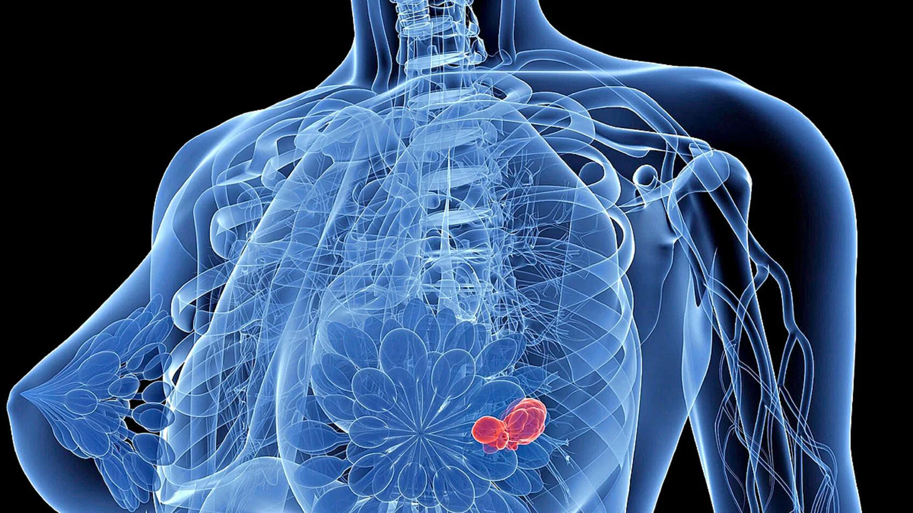

+++
title = "Krebs, Leben um jeden Preis?"
date = "2023-04-04"
draft = false
pinned = false
description = "Sabine und Ute haben den Brustkrebs erfolgreich bekämpft, doch soll \nman in jedem Fall therapieren? Diese Reportage soll Aufschluss über die \nReise mit dem Krebs und den zusammenhängenden Umständen geben."
+++


Sabine und Ute haben den Brustkrebs erfolgreich bekämpft, doch soll man in jedem Fall therapieren? Diese Reportage soll Aufschluss über die Reise mit dem Krebs und den zusammenhängenden Umständen geben.

## Diagnose

Dreissig Prozent. Nachts lag ich schlaflos im Bett, starrte an die Decke und dachte: Was bedeuten dreissig Prozent? Wenn man an der Grenze zwischen Leben und Tod steht, der Krebs einen aushöhlt und das Leben einem nur noch Leiden bereitet, stellt sich die Frage: Krebs… Leben um jeden Preis? Auf der Suche nach Antworten, haben wir uns mit Sabine und Ute unterhalten. Zwei aufgestellte, lebensfrohe Frauen. 165 km trennen uns von unseren Interviewpartnerinnen, die Gespräche fanden über die Plattform Teams statt. So trafen wir Beide pünktlich um 16 Uhr vor dem Bildschirm an, als Hintergrund haben sie ein Buisnesszimmer eingeblendet.

Ute war 52 Jahre alt, als sie einen 1-2 cm grossen Knoten in ihrer rechten Brust erfühlte, mit böser Vorahnung liess sie sich von einer Onkologin untersuchen. «Als ich mit der Krankheit Krebs diagnostiziert wurde, fühlte es sich an, als würde mir der Boden unter den Füssen weggezogen, man steht vor einem langen Prozess, der viel Kraft und Willensstärke fordert.» Der Brustkrebs, medizinisch das Mammakarzinom, ist die häufigste Krebserkrankung bei Frauen. In der Schweiz erkranken jährlich 6300 Frauen. Krebszellen breiten sich unkontrolliert in der Brustdrüse aus, dabei unterscheidet man zwischen invasivem und nicht-invasivem Brustkrebs, invasiv bedeutet, die Krebszellen sind ins Nachbargewebe eingedrungen, Ute hatte einen nicht-invasiven Krebs, das heisst es liegt eine örtlich begrenzte Vorstufe des Brustkrebses vor. Ute versuchte viele wertvolle Informationen über die Krankheit Krebs zu bekommen, um die Angst, die sie vor dem Krebs hatte, in Respekt umzuwandeln. Dies ist und war sehr wichtig für ihren Umgang mit der Krankheit, denn Angst, Ungewissheit seien sehr unangenehme Begleiter. «Kenne deinen Feind», ist unter Ärzt: Innen ein altbekannter Spruch, um den Krebs heilen zu können, muss man ihn, mit all seinen Tücken, vollständig verstehen.



## Therapie

«Das Erste, was mir der Frauenarzt gab, war eine Visitenkarte eines Perückenmachers» Sabine erklärt, dass es auch Leute gab, die nicht mit ihrer Diagnose umgehen konnten. Umso wichtiger war für sie zu sehen, dass es Leute gab, die immer anriefen, unabhängig davon, ob es ihr gerade gut oder schlecht ging. Sie habe gemerkt, wer zu ihr steht. «Meine Töchter und mein Mann waren eine grosse Hilfe.» Frauenklinik, Inselspital, der Raum mit den ausschliesslich weissen Möbeln erstrahlt in hellem Licht. Dr. med. Rabaglio kommt zur Tür hinein, unter dem Arm ein ebenfalls weisses Klemmbrett. «Die Idee, dass man Krebs mehr und mehr heilen kann, faszinierte mich». Rabaglio arbeitet seit mehr als 20 Jahren im Fachgebiet der Onkologie, täglich befasst sie sich mit Brustkrebs PatientInnen. Richtig, Patienten und Patientinnen, Rabaglio verweist darauf, dass auch Männer an Brustkrebs erkranken können, jedoch ist die Erkrankung bei Männern sehr selten.

Im Alltag ist Manuela Rabaglio mit vielerlei Tätigkeiten beschäftigt «Ich erstelle Therapiepläne, diese werden meist in Zyklen geführt. Es werden Infusionen und Medikamente verabreicht, Blutwerte/ Nebenwirkungen kontrolliert. Neue Patient\*innen werden einer Biopsie unterzogen, um den auf sie zugeschnittenen Therapieplan, erstellen zu können». Während einer Biopsie findet man zum Beispiel heraus, ob ein/e Patient\*in Hormonrezeptor positiv oder negativ ist. Positiv bedeutet, die Hormone Östrogen und Progesteron können an die Rezeptoren binden, dies wiederum fördert das Krebswachstum. «Durch den Krebs bin ich Salatliebhaberin geworden» Ute und Sabine verzichten auf übermässigen Fleischkonsum, Milch sei nicht mehr in ihren Kühlschränken vorzufinden, denn sowohl Fleisch als auch Milch enthalten die oben genannten Hormone.

```

```

## «Wer kann mir noch was? Ich habe Krebs besiegt!»

Was für Manuela Alltag ist, gehört für Krebs Patient*innen zu einer der einschneidendsten Erlebnisse ihres Lebens. Als Sabine zum ersten Mal realisierte, dass sie Krebs hat, fühlte sie sich hilflos, doch viele haben ihr geholfen, den furchtbaren Krebs mental durchzustehen: « ‘Fear is an Illusion. False Evidence, Appearing, Real’; Angst hält dich zurück, du kannst nicht richtig reagieren, weil du in Panik gerätst, du bist dir nicht sicher, nicht alle deine Sinne sind da, um eine gute Entscheidung zu treffen.» 

Sabine Teschke Sie erklärt, man müsse die Situation zuerst aufnehmen und sich überlegen, was realistischerweise passieren könnte, anstatt sich immer das schlimmste Szenario auszumalen. Somit hielt sie nichts davon ab, ihr Leben voll auszukosten. Die Therapie hat sie schlauer und stärker im Umgang mit Situationen gemacht, die zunächst fast unüberwindbar erscheinen. «Es zeigt einem, wo die Prioritäten liegen.» Nun ist sie noch ehrlicher und schonungsloser: «Krebs ist ein Arschloch!», Sabine betont, dass sei eigentlich nicht ihre Sprache, doch für den Krebs macht sie eine Ausnahme. 

Es gibt auch Patient*innen, die sich nicht behandeln lassen wollen: «In einem solchen Fall führe ich mit meinen Patienten ein zweites Gespräch durch. Es ist besonders wichtig, den Patienten wirklich genug Zeit zu geben, sich das genau zu überlegen», sagt Dr. Rabaglio. Ute sagt, dass es während ihrer Therapie und später in der Rehabilitation Leute gab, die sich zwar dazu entschieden, sich therapieren zu lassen, aber lebensmüde waren: «Vor der Chemotherapie gab es jede Woche eine Gruppensprechrunde mit vier weiteren Krebserkrankten.» Die Aufgabe war es zu erzählen, wofür man diese Woche dankbar war. «Ich konnte nicht glauben, dass es nichts gab, was sie im Leben antrieb“, sagt Ute bedrückt: «In dem Moment taten sie mir leid.»

 «Vogelzwitschern, der frühe Morgen, mein Liebster an meiner Seite, und wir geniessen zusammen einen Latte Macchiato», das war es, was Ute in dieser Woche glücklich machte: «Was gibt es denn Schöneres? Alle meinten dann zu mir: ‘Wow Ute, du bist ein Phänomen! ’»

 «Ich würde je nach Situation vorgehen; wenn ich weiss, dass eine weitere Behandlung nur Nebenwirkungen mit sich bringt, werde ich meinen Patient\*innen definitiv raten darauf zu verzichten», erklärt Dr. Rabaglio. Anders als bei Sabine und Ute gibt es Patient\*innen, bei denen der Krebs schon so stark fortgeschritten ist, dass Behandlungen mehr Nebenwirkungen, als die Chance auf Heilung mit sich bringen. Supportive Mittel werden in diesem Fall eingesetzt, um die verbleibende Zeit bestmöglich überstehen zu können. 

## Verbreitet den Krebs in den Medien!

Sabine gründete in Stryker ihre eigene Selbsthilfe Gruppe: «Die Krankheit soll nicht tabuisiert werden.» Sabine und Ute hatten sich beide durchs Internet gefressen, um alles über den Krebs zu erfahren. Durch ihre Recherchen fand Sabine einen Booster, von dem sie ihren Ärzt*innen berichtete und nach dessen Einführung, ihre Therapie von 28 auf 18 Bestrahlungen reduziert wurde. Wenn sich die Menschen mehr austauschen würden, wären solche Ratschläge bekannter. Man kann über Diagnosen oder Statistiken sprechen, aber die eigene Geschichte zu teilen, bringt die Menschen zusammen und motiviert dabei, sich ihren Herausforderungen zu stellen. «Leute sind froh, wenn man mit ihnen spricht, auch wenn die Worte fehlen», erklärt Sabine. Beide wünschten sich bei diesem Thema mehr Präsenz in den Medien.

## Krebs-Prognosetest

 Als Ute diagnostiziert wurde und nachdem sie ihren Tumor herausoperiert hatte, gab es die Möglichkeit einen sogenannten Zukunftstest durchzuführen, der die Wahrscheinlichkeit eines Rezidivs anzeigt. Da diese Prozentzahl bei Ute hoch war, führte sie nach der Operation noch eine Chemotherapie durch. Sabine wurde andererseits schon diagnostiziert, bevor der Zukunftstest vorhanden war. Heute besteht jedoch die Gelegenheit sich testen zu lassen. Sabine hat sich gefragt, ob sie wissen will, wie gross die Chance auf einen Rückfall ist und ob sie dann auch nochmals eine Therapie durchführen würde. Lange hat sie sich mit der Frage auseinandergesetzt und schlussendlich entschieden, es nicht zu tun. Sie fühlt sich in ihrer jetzigen Situation mit den regelmässigen Kontrollen wohl und ist zufrieden, wo sie jetzt steht. Denn während wir diese Reportage vervollständigen, ist sie in Sri Lanka unterwegs auf einem Wellness Trip!

# «Es war unser Kampf!»

## Heilung

 Nachdem Sabines letzte Bestrahlung vorbei war, liess ihr Chef ihr Team aus ganz Europa nach Amsterdam einfliegen, wo sie beruflich gerade unterwegs war. «Ich habe erst mal geweint wie ein Schosshund», sie freute sich wieder da zu sein. 

Nach einer langen und schwierigen Zeit mit zahlreichen Therapien und vielen Gesprächen mit Ärzten\*innen ist der Tag gekommen, auf den alle Krebspatient\*innen seit dem Tag der Diagnose warten. Der Tag, an dem die Behandlung endlich vorbei ist und sie wieder ihrem Alltag nachgehen können.

«Natürlich ist es immer schön, einen Patienten nach Hause schicken zu können», sagt Dr. Rabaglio erfreut. Es gibt neben der Mehrheit, die gesund nach Hause dürfen, auch eine Minderheit, die es leider nicht wieder aus dem Spital schaffen. «Als Arzt muss man damit umgehen können, wenn ein Patient stirbt. Aber deshalb ist es immer umso schöner, wenn jemand den ganzen Prozess erfolgreich durchläuft. Es braucht einfach diesen Ausgleich.» Ute kann bestätigen, dass das Glücksgefühl nicht nur auf der Seite der Ärzte war, als sie ihre Therapien durchgestanden hatte: «Es war ein befreiendes Gefühl. Ich startete wieder neu durch!» Sie freute sich auf ihr altes Leben mit ihren Freunden und Kollegen und als wir sie vor einigen Tagen interviewten, berichtete sie uns freudig, sie fühle sich sehr gut: «Ich würde fast behaupten, wie vor der Diagnose.» In ihren Alltag hat sie sich wieder erfolgreich eingefügt und geniesst ihr Leben in vollen Zügen. «Ich habe schon früher sehr bewusst gelebt, aber nun ist es noch intensiver geworden», erzählt uns Ute und verweist auf den besagten Spruch: Das letzte Hemd hat keine Taschen, was uns alle zu Lebzeiten daran erinnern soll, dass man in den Tod nichts mitnehmen kann.

 Sie hat sich dem Krebs von Anfang an mit Mut und Entschlossenheit gestellt. Sie selbst hat mit ihrer positiven Einstellung und Willenskraft diesen Kampf geführt, und gesiegt. Sie ist sich nun sicher, dass der Krebs nicht zurückkommt: «Ich habe für mich beschlossen, das war ein Ausrutscher und eine einmalige Sache.» Ein allbekanntes Zitat der Onkologie besagt: «Einmal Krebs, immer Krebs». Jedoch wäre es wichtig, dies etwas anzupassen. Das Wichtigste bei allen unglücklichen Abzweigern im Leben, ist es, daran zu glauben, dass man wieder einen Weg zur Hauptbahn finden wird: «Einmal Krebs, nie mehr Krebs?»